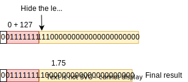

# Floating Point Adder
This device performs the sum of two 32-bit floating point numbers.  
To do that, the fp_adder executes the following steps:
 - Determine the floating point representation fields of the two inputs;  
 
 - Subtract the expoent fields (represented using excess-127) to find the greatest one;  
 
 - Shift right the mantissa (with the hidden 1) of the number with the smaller expoent by the difference found earlier;  
 
 - Add/sub the mantissas according to the input signal bits (Sa **xor** Sb);  
 
 - Normalize the result, finding the leading 1 and either shifting right and incrementing the expoent or shifting left and decrementing the expoent;  
 
 - Round off the bits shifted out due to the normalization proccess if necessary.  
  

## Structure

