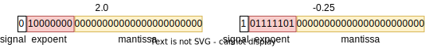

# Floating Point Divider
This device performs the division of two 32-bit floating point numbers.  
To do that, the fp_divider executes the following steps:  
 - Determine the floating point representation fields of the two inputs;  
 
 - Check if any input number (expoent and mantissa fields) is equal to 0. If so, the additional implicit bit will be 0. Otherwise, it will be equal to 1;  
   
 - Subtract the expoents of the two numbers and sum the result by bias value (127);  
   
 - Divide the manstissas (with the implicit bit defined earlier) using fixed point mode;  
    

 ## Structure

 