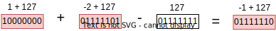
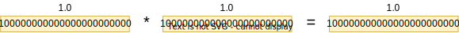
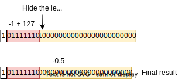

# Floating Point Multiplier
This device performs the multiplication of two 32-bit floating point numbers.  
To do that, the fp_divider executes the following steps:  
 - Determine the floating point representation fields of the two inputs;  
 
 - Check if any input number (expoent and mantissa fields) is equal to 0. If so, the additional implicit bit will be 0. Otherwise, it will be equal to 1;  
   
 - Sum the expoents of the two numbers and subtract the result by bias value (127);  
   
 - Multiply the manstissas (with the implicit bit defined earlier);  
    
 - Define the output signal bit (Sa **xor** Sb);  
    
 - Normalize the result, finding the leading 1 and either shifting right and incrementing the expoent or shifting left and decrementing the expoent;  
    
 - Round off the bits shifted out due to the normalization proccess if necessary.  
   

 ## Structure

 